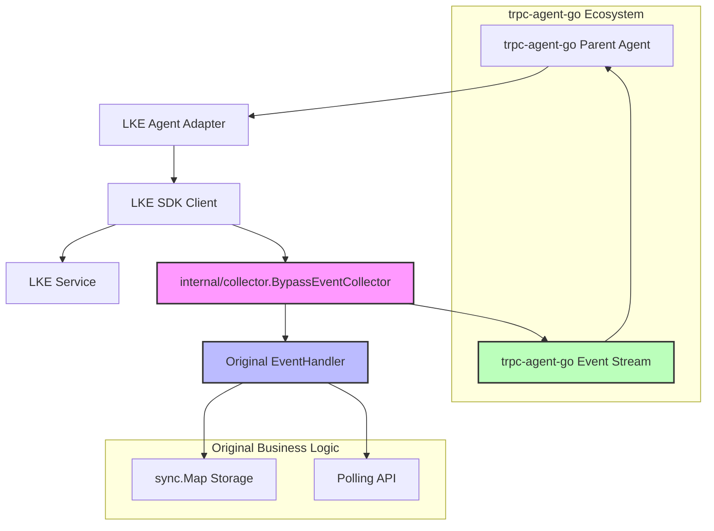

# LKE Agent Adapter

This package provides adapters to integrate Tencent Cloud LKE SDK-based Agents into the `trpc-agent-go` ecosystem.

## Core Features

### 🔄 Zero-Disruption Integration
- **Preserve Existing Logic**: Your existing LKE Agent code (including `EventHandler` implementations and `sync.Map` storage) requires no modification
- **Bypass Event Stream**: Creates an event "bypass" through `BypassEventCollector`, sending data to both original handler and `trpc-agent-go` event stream
- **Independent Session Management**: LKE SDK manages sessions with LKE service, `trpc-agent-go` manages wrapper Agent sessions

### 📡 Event Bridging
- **Complete Event Coverage**: Supports all LKE events including `OnReply`, `OnThought`, `OnError`, `BeforeToolCallHook`, `AfterToolCallHook`
- **Intelligent Conversion**: Automatically converts LKE events to `trpc-agent-go` `event.Event` format  
- **Transparent Tool Calls**: Preserves LKE SDK tool call mechanisms while exposing tool execution events to `trpc-agent-go`
- **Configurable Bypass**: Control event flow through `WithEventBypass()` option

## Quick Start

### Basic Usage

```go
package main

import (
    "context"
    "github.com/tencent-lke/lke-sdk-go"
    lkeagent "trpc.group/trpc-go/trpc-agent-go/agent/lkeagent"
    "trpc.group/trpc-go/trpc-agent-go/runner"
)

// Your existing EventHandler implementation
type MyExistingHandler struct {
    // Your business logic, e.g., storing to sync.Map
}

func (h *MyExistingHandler) OnReply(reply *event.ReplyEvent) {
    // Your existing business logic continues to work normally
    // e.g., storing to global sync.Map for polling interface usage
    UserSessionStorage.Store(sessionID, reply)
}

// ... other existing callback implementations

func main() {
    // 1. Create your existing LKE client and handler
    existingHandler := &MyExistingHandler{}
    lkeClient := lkesdk.NewLkeClient(botAppKey, existingHandler)
    
    // 2. Wrap as trpc-agent-go Agent with functional options
    agent := lkeagent.New(lkeClient,
        lkeagent.WithName("my-lke-agent"),
        lkeagent.WithOriginalHandler(existingHandler),
        lkeagent.WithVisitorBizID("user-123"),
        lkeagent.WithBufferSize(100),
    )
    
    // 3. Use in trpc-agent-go ecosystem
    runner := runner.NewRunner("my-app", agent)
    
    // Now you can:
    // - Be scheduled as SubAgent
    // - Provide services as A2AAgent
    // - Combine with other trpc-agent-go components
    
    // Your existing business logic (like polling interfaces) continues to work normally!
}
```

### Advanced Configuration

```go
agent := lkeagent.New(lkeClient,
    lkeagent.WithName("download-agent"),
    lkeagent.WithOriginalHandler(existingHandler),
    lkeagent.WithDebug(true),                         // Enable debug logging
    lkeagent.WithBufferSize(200),                     // Event buffer size  
    lkeagent.WithVisitorBizID("custom-visitor"),      // Custom visitor ID
    lkeagent.WithEventBypass(true),                   // Control event bypass
    lkeagent.WithLKEOptions(&model.Options{           // LKE client options
        StreamingThrottle: 20,
        CustomVariables: map[string]string{
            "_user_guid": "user-123",
        },
    }),
)
```

## Architecture Design

### Data Flow Diagram



### Core Components

#### 1. `LKEAgent`
Adapter implementing the `trpc.group/trpc-go/trpc-agent-go/agent.Agent` interface:

```go
type LKEAgent struct {
    name           string
    lkeClient      lkesdk.LkeClient
    eventCollector *BypassEventCollector
    // ...
}
```

#### 2. `internal/collector.BypassEventCollector`  
Internal event collector implementing the `lkesdk.EventHandler` interface:

```go
// Note: This is internal implementation, not part of public API
type BypassEventCollector struct {
    original  lkesdk.EventHandler  // Your original handler
    eventChan chan *event.Event    // Bypass to trpc-agent-go
    // ...
}
```

## Integration Strategy

### Session Management Strategy

```go
// LKE SDK session (internally managed)
lkeClient.Run(query, sessionID, visitorBizID, options)

// trpc-agent-go session (framework managed)
runner.Run(ctx, invocation) // invocation.SessionID
```

Two session systems work independently:
- **LKE Session**: Manages conversation context with LKE service
- **trpc-agent-go Session**: Manages wrapper Agent state within the framework

### Tool Management Strategy

```go
// LKE tools (internally managed)
lkeClient.AddFunctionTools("Agent-A", tools)
lkeClient.AddMcpTools("Agent-A", mcpClient, nil)

// trpc-agent-go tools (return empty list to avoid conflicts)
func (a *LKEAgent) Tools() []tool.Tool {
    return []tool.Tool{}  // LKE manages internally
}
```

## Use Cases

### 1. Migrate Existing download_agent

```go
// Original download_agent implementation
type downloadAgentImpl struct {
    agentTaskImpl agent_task.AgentTask
}

// Wrap as trpc-agent-go Agent
func NewDownloadAgent() agent.Agent {
    // Create LKE client and handler
    existingHandler := &MyEventHandler{}
    lkeClient := lkesdk.NewLkeClient(botAppKey, existingHandler)
    
    // Add tools
    lkeClient.AddFunctionTools("Agent-A", downloadTools)
    
    // Wrap as Agent with functional options
    return lkeagent.New(lkeClient,
        lkeagent.WithName("download-agent"),
        lkeagent.WithOriginalHandler(existingHandler),
    )
}
```

### 2. Use as SubAgent

```go
parentAgent := &MyParentAgent{
    subAgents: map[string]agent.Agent{
        "download": NewDownloadAgent(),
        "upload":   NewUploadAgent(),
    },
}
```

### 3. Provide Services as A2AAgent

```go
downloadAgent := NewDownloadAgent()
a2aClient := a2a.NewClient(downloadAgent)
```

## Migration Checklist

- [ ] Existing LKE Agent code requires no modification
- [ ] Existing `EventHandler` implementation continues to work
- [ ] Existing `sync.Map` storage logic continues to work  
- [ ] Existing polling API continues to work
- [ ] Added `trpc-agent-go` event stream support
- [ ] Can be scheduled as SubAgent
- [ ] Can provide services as A2AAgent
- [ ] Combine with other `trpc-agent-go` components

## Comparison with Eino Adapter

| Feature | Eino Adapter | LKE Adapter |
|---------|--------------|-------------|
| Preserve Existing Code | ❌ Need migration to Eino mode | ✅ Zero modification preservation |
| Event Processing | 🔄 Convert to Eino format | 🔄 Bypass bridging |
| Tool Management | 🔧 Unified to trpc-agent-go | 🔧 Keep LKE internal management |
| Session Management | 🎯 Full integration | 🎯 Dual-layer independent management |
| Migration Cost | 📈 Medium | 📉 Very low |

## FAQ

### Q: Can existing polling interfaces still be used?
A: Yes, absolutely. Your `EventHandler` continues to store data to `sync.Map`, and `GetAgentTask` API continues to read data from `sync.Map`.

### Q: Will there be performance issues?
A: No. Events are just sent to the `trpc-agent-go` event stream additionally, without affecting the performance of existing logic.

### Q: Can we use only `trpc-agent-go` event stream and deprecate polling interfaces?
A: Yes, but requires modifying business logic. For zero-disruption migration, we recommend keeping existing interfaces.

### Q: How do LKE tools and trpc-agent-go tools coordinate?
A: LKE SDK manages tools internally, `trpc-agent-go` perceives tool calls through event streams but doesn't directly manage LKE tools.

### Q: How is session data shared?
A: It's not shared. LKE session manages conversations with LKE service, `trpc-agent-go` session manages wrapper Agent state. Both operate independently.
